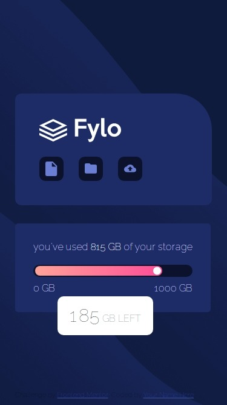

# Frontend Mentor - Fylo data storage component

his is a solution to the [Clipboard landing page challenge on Frontend Mentor](https://www.frontendmentor.io/challenges/clipboard-landing-page-5cc9bccd6c4c91111378ecb9). Frontend Mentor challenges help you improve your coding skills by building realistic projects. 

### Table of contents

  - [Screenshot](#screenshot)
  - [Links](#links)
  - [Built with](#built-with)
  - [Author](#author)
  - [Acknowledgments](#acknowledgments)

## Overview

### Screenshot

### Links

- Solution URL: [Asolution URL](https://your-solution-url.com)
- Live Site URL: [ live site URL](https://your-live-site-url.com)

### Built with

- Semantic HTML5 markup
- CSS custom properties
- Flexbox

## Author

- Website -islem touhami
- Frontend Mentor - [@islem touhami](https://www.frontendmentor.io/profile/islemtouhami)
